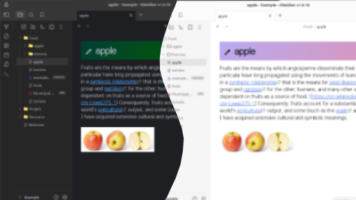
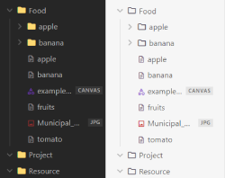
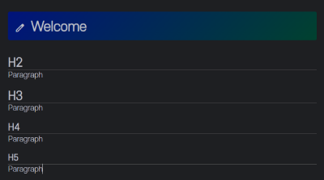

Myst Theme for Obsidian.

## Introduction
The CSS has been modified with reference to IntelliJ color schemes.  
Confirmed to work properly on Obsidian v1.8.9.

## Features
- Title Style Change: Added a pen icon at the beginning of titles to make it clear when editing is in progress, and used an animated background effect to keep things visually engaging.
- Added lines below H2 headings to help distinguish between sections more clearly.
- Used different colors to emphasize text and make it stand out.
- Change the default font to `S-CoreDream-3Light`.
- Added folder icons in the file explorer to make it easier to distinguish between folders and files.

## Screenshots

## References
- [Build a theme](https://docs.obsidian.md/Themes/App+themes/Build+a+theme)
- [Release your theme with GitHub Actions](https://docs.obsidian.md/Themes/App+themes/Release+your+theme+with+GitHub+Actions)
- [Submit your theme](https://docs.obsidian.md/Themes/App+themes/Submit+your+theme)
- [Embed fonts and images in your theme](https://docs.obsidian.md/Themes/App+themes/Embed+fonts+and+images+in+your+theme)

## License
MIT
